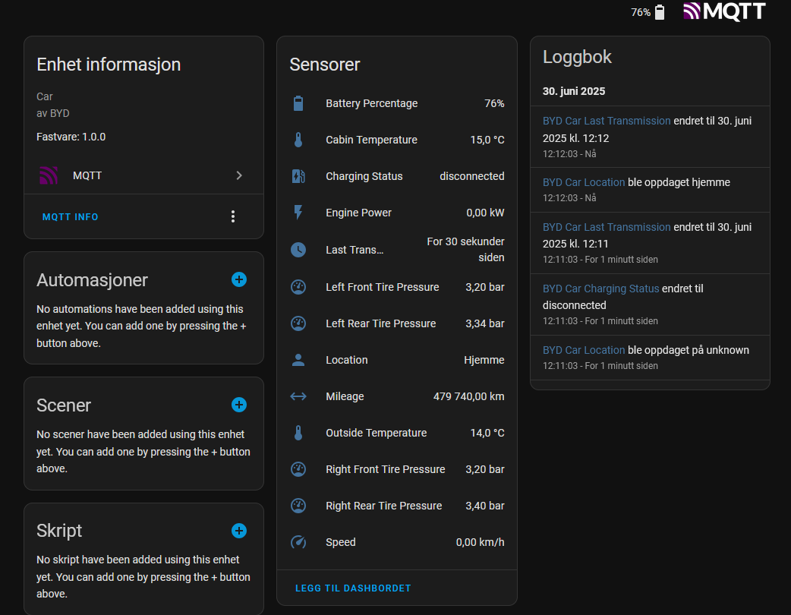

# BYD-HASS

BYD-HASS is a small Go program that turns data from the Diplus API into MQTT messages that Home Assistant can understand, and (optionally) telemetry for A Better Route Planner (ABRP).  It is built as a single static binary so it can run in the car's infotainment using Termux.

## How it works

1. Every 8 seconds `byd-hass` calls the Diplus API (`http://localhost:8988/api/getDiPars`)
2. Values are cached in memory. Nothing is sent unless a value has changed since the last time it was transmitted.
3. Changed values are published:
   - to MQTT every 60 seconds and are discovered by Home Assistant
   - to ABRP every 10 seconds if an ABRP API key and ABRP TOKEN are supplied **and** the ABRP Android app is running (can be disabled with `-require-abrp-app=false`).
4. **Optional forced updates**: If `-force-update-interval` is set (e.g., `10m`), all sensor values are transmitted at that interval even if unchanged. This ensures periodic updates for systems that need regular data refreshes.

## Quick start

### Prerequisites

1. **Enable Wireless Debugging** on the car's infotainment

2. **Install Termux** from [F-Droid](https://f-droid.org/packages/com.termux/) or [GitHub](https://github.com/termux/termux-app/releases)

3. **Have an MQTT broker ready** – normally the one already used by Home Assistant (tip: if you're gonna use this while traveling, consider [MQTT over WebSocket](https://cedalo.com/blog/enabling-websockets-over-mqtt-with-mosquitto/))

### Run the installer

Open Termux and run:

```bash
bash <(curl -sSL https://raw.githubusercontent.com/jkaberg/byd-hass/main/install.sh)
```

The installer will:
- Download and install the `byd-hass` binary
- Check for and offer to install missing dependencies (Diplus, Termux:API, Termux:Boot)
- Ask for your MQTT and ABRP settings
- Configure the program to start automatically and keep running indefinitely

**Note:** After installation, make sure to grant the required permissions to Diplus, Termux, Termux:Boot, and Termux:API (especially location permissions for GPS functionality).

### Optional: ABRP telemetry

If you want to send telemetry to A Better Route Planner, you'll also need:
- [ABRP Android app](https://play.google.com/store/apps/details?id=com.iternio.abrpapp) running in the background (can be disabled with `-require-abrp-app=false`)
- Your ABRP API key and user token (provided during installation)

---

### Updating and maintenance

Re-run the installer at any time to update to the latest version:

```bash
bash <(curl -sSL https://raw.githubusercontent.com/jkaberg/byd-hass/main/install.sh)
```

To stop all running processes (useful before reconfiguring):

```bash
./install.sh cleanup
```

## Configuration

Settings can be supplied as command-line flags or environment variables (prefix `BYD_HASS_`).

| Flag | Environment variable | Purpose |
| ---- | -------------------- | ------- |
| `-mqtt-url`            | `BYD_HASS_MQTT_URL`          | MQTT connection string (e.g. `ws://user:pass@broker:9001/mqtt`) |
| `-abrp-api-key`        | `BYD_HASS_ABRP_API_KEY`      | ABRP API key (optional) |
| `-abrp-token`          | `BYD_HASS_ABRP_TOKEN`        | ABRP user token (optional) |
| `-require-abrp-app`    | `BYD_HASS_REQUIRE_ABRP_APP`  | Require ABRP Android app to be running before sending telemetry (default `true`) |
| `-enable-wifi-reenable` | `BYD_HASS_ENABLE_WIFI_REENABLE` | Automatically re-enable WiFi if it gets disabled (default `false`) |
| `-device-id`           | `BYD_HASS_DEVICE_ID`         | Unique name for this car (default is auto-generated) |
| `-verbose`             | `BYD_HASS_VERBOSE`           | Enable extra logging |
| `-discovery-prefix`    | ―                            | MQTT discovery prefix (default `homeassistant`) |
| `-mqtt-interval`       | `BYD_HASS_MQTT_INTERVAL`      | Override MQTT transmission interval (`60s` default) |
| `-abrp-interval`       | `BYD_HASS_ABRP_INTERVAL`      | Override ABRP transmission interval (`10s` default) |
| `-force-update-interval` | `BYD_HASS_FORCE_UPDATE_INTERVAL` | Force update all sensors at this interval even if unchanged (e.g., `10m`, `0` = disabled, default `0`) |
|                        | `BYD_HASS_SENSOR_IDS`        | Override default sensors published, use format "id:publish,id,...", publish can be ommited, default to true, for example "33:1,34,1:0" meaning publish id's 33 and 34, but also read id 1 and don't publish. For more details see [here](https://github.com/jkaberg/byd-hass/blob/main/internal/sensors/sensor_ids.go#L39-L50)  |

## Home Assistant sensors

When connected to MQTT, Home Assistant automatically discovers a single device with many entities such as battery %, speed, mileage, lock state, and more. See picture:



### Typical MQTT entities

Below is the default subset of BYD signals that are exposed via MQTT (others remain internal for now).  Entity IDs follow Home Assistant conventions (`snake_case`).

| Entity ID | Friendly name | Device class | Unit | Notes |
|-----------|---------------|--------------|------|-------|
| `battery_percentage` | Battery State of Charge | battery | % | High-voltage battery SOC. |
| `fuel_percentage` | Fueal tank fill percentage | battery | % | Fuel tank fill. |
| `speed` | Speed | speed | km/h | Vehicle speed. |
| `mileage` | Odometer | distance | km | Total mileage (odometer). |
| `engine_power` | Power | power | kW | Positive → driving, negative → regen/charging. |
| `outside_temperature` | Outside Temperature | temperature | °C | Outside temperature sensor. |
| `cabin_temperature` | Cabin Temperature | temperature | °C | Interior temperature sensor. |
| `left_front_tire_pressure` | LF Tire Pressure | pressure | bar | Raw value is in bar (converted to kPa for ABRP). |
| `right_front_tire_pressure` | RF Tire Pressure | pressure | bar |  |
| `left_rear_tire_pressure` | LR Tire Pressure | pressure | bar |  |
| `right_rear_tire_pressure` | RR Tire Pressure | pressure | bar |  |
| `charging_status` | Charging Status | None | — | Virtual sensor derived from charge-gun state & power (`disconnected`, `connected`, `charging`). |
| `last_transmission` | Last Transmission | timestamp | — | UTC timestamp of last successful publish. |
| `device_tracker.<device_id>` | Location | gps | — | Standard HA device-tracker entity fed by GPS or network (if available). |

This list matches the `internal/transmission/mqtt_ids.go` allow-list and can be customised in code if you need more or fewer metrics.

## Building from source

```bash
./build.sh   # produces a static arm64 binary for Termux
```

The build script cross-compiles for Android (GOOS=linux GOARCH=arm64 CGO_ENABLED=0) and strips debug symbols for a small footprint.

## Notes

This project is not affiliated with BYD, the Diplus authors, Home Assistant, or ABRP.  Use at your own risk.

## Estimated data usage (Wi-Fi/Cellular)

> The figures below are **ball-park estimates** intended to help you plan for mobile data usage when running `byd-hass` on the infotainment. Actual usage will vary with driving style, connection quality, MQTT broker behaviour, etc.

### How the numbers were derived

1. **Message sizes** – The program currently sends three types of outbound traffic:
   * **MQTT state payload** (`byd_car/<device>/state`). A full JSON state containing ~25 numeric/boolean fields plus topic and protocol overhead is ~ **130 bytes** per publish.
   * **ABRP telemetry call** (HTTPS `POST`). The documented ABRP payload is smaller than the MQTT state but the TLS, HTTP and header overheads are higher. One update is ~ **500 bytes** on the wire.
   * **MQTT keep-alive (PINGREQ + PINGRESP)**. Over WebSocket/TCP a full round-trip (frame + TCP/IP headers each way) is ~ **100 bytes**.
2. **Send intervals** –
   * **MQTT**: every **60 s** *but only while at least one value has changed*. When the car is parked usually nothing changes, so the broker typically only sees a retain/heartbeat publish once an hour. During driving almost every minute triggers an update.
   * **ABRP**: fixed **10 s** interval (subject to the same *value-changed* guard as MQTT). When the car is parked the snapshot rarely changes, so only a handful of telemetry calls are triggered. The logic is active only when the **ABRP telemetry feature itself is enabled** – i.e. an API key/token were supplied *and* the `-require-abrp-app` (defaults to `true`) flag (or `BYD_HASS_REQUIRE_ABRP_APP`) is satisfied at runtime.
   * **MQTT keep-alive**: one ping round-trip every **60 s** (client default) 24 × 7, regardless of driving.
3. **Downtime assumption** – Cars spend most of the time parked. For a "typical commuter" profile we assume **1 h of driving per day** and **23 h parked**. A pessimistic worst-case and an optimistic best-case are also shown.

### Monthly totals (30-day month)

| Scenario | Driving / day | MQTT state | ABRP | MQTT ping | **Total** |
| -------- | ------------- | ---------- | ----- | --------- | --------- |
| **Typical** (default) | 1 h | 60 msg × 130 B × 30 d = **0.23 MB** | 360 msg × 500 B × 30 d = **5.4 MB** | 1 440 ping × 100 B × 30 d = **4.3 MB** | **≈ 10 MB** |
| Light usage | 30 min | 0.11 MB | 2.7 MB | 4.3 MB | **≈ 7 MB** |
| Heavy usage | 4 h | 0.9 MB | 21.6 MB | 4.3 MB | **≈ 27 MB** |

Even in the heavy-usage scenario the program stays well under 30 MB per month, which is only ~3 % of the 1 GB cellular plan BYD provides in many countries.

*Tip: if you do **not** need ABRP telemetry you can disable it (omit `-abrp-api-key`) and cut data usage by roughly **90 %**.*
